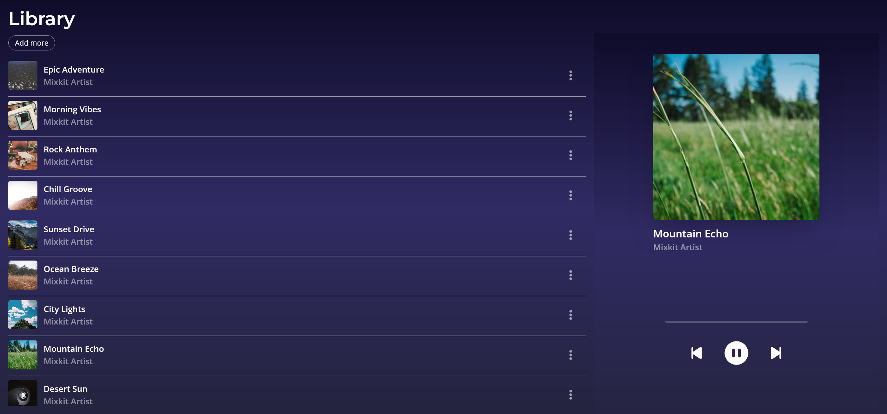
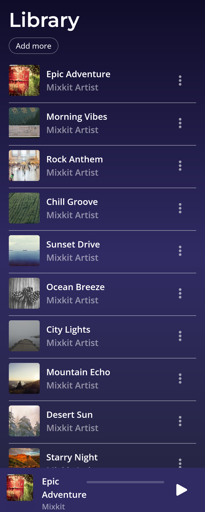
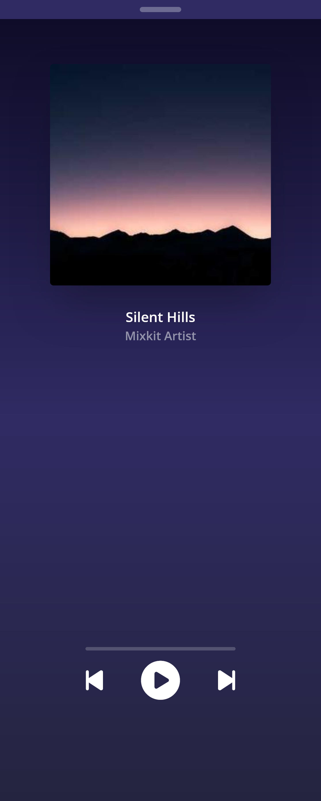

# 🎵 Music Player App

## Overview

This is a simple **Music Player web app** built with **Java, Spring Boot, Angular, and TypeScript**.
It allows you to:

* See a list of songs
* Play, pause, go to next or previous song
* See a progress bar showing how far the song has played
* On desktop: player is always visible
* On mobile: player opens when you select a song

This was my **first project using Java, Spring Boot, Angular, and TypeScript**. I built it to learn full-stack development :)

---

## Features

* **Song List:** View and delete songs
* **Music Player:** Play/Pause, Next, Previous, progress bar
* **Responsive Design:** Works on desktop and mobile
* **State Sharing:** Player updates automatically when a song is selected

---

## Tech Stack

* **Backend:** Java, Spring Boot, MySQL, Docker, DBeaver
* **Frontend:** Angular 21, TypeScript, Tailwind CSS, HTML, CSS

